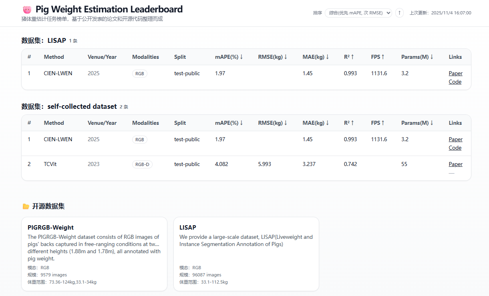

[English](./README-EN.md) | [中文文档](./README.md)

# 猪体重估计任务 - 排行榜

欢迎来到 **猪体重估计任务** 的排行榜项目！本项目展示了最新的研究在该任务中的表现，并按评估指标（如 MAPE、RMSE 等）进行排名。

## Todolist
### 1. 数据与指标展示
- [x] 榜单网站搭建 
- [ ] 整理各研究团队的公开结果数据      

### 2. 页面优化 / Frontend Enhancement
- [x] 添加动态刷新功能（每天自动更新）  
- [x] 支持指标排序（点击表头排序）  
- [ ] 支持按模态（RGB、Depth、Thermal 等）筛选  
- [ ] 为每个方法添加 tooltip 说明或论文摘要悬浮窗  

### 3. 内容完善 / Content Update
- [ ] 增补排行榜中的论文与代码链接  
- [ ] 添加“方法说明”与“数据集简介”小节  
- [ ] 整理参考文献列表（含 DOI / arXiv 链接）  
  
### 4. 后续拓展 / Future Work  
- [ ] 开放排行榜提交接口（PR / JSON 格式提交）    

---

## 任务说明

该任务的目标是基于不同的传感器数据（如图像、深度图等），估算猪的体重。参与者需要开发模型来准确地预测猪体重，并提供模型的评估结果。

## 排行榜

## 评估指标

我们使用以下几个评估指标来衡量模型的表现：

- **MAPE** (Mean Absolute Percentage Error): 预测值与实际值的百分比误差的平均值。
- **RMSE** (Root Mean Squared Error): 预测值与实际值的均方根误差。
- **MAE** (Mean Absolute Error): 预测值与实际值的绝对误差的平均值。
- **R²**: 模型预测与实际值之间的决定系数。

## 数据集

该任务使用的数据集包括不同猪只的图像及对应体重数据，涉及多个姿态和环境条件。详细的数据集说明请参考 [数据集链接](https://example.com)。

## 贡献者

感谢以下团队/个人为本任务做出的贡献,欢迎感兴趣的同学贡献：

- Peiguang Xin(xin1099477816@163.com)

